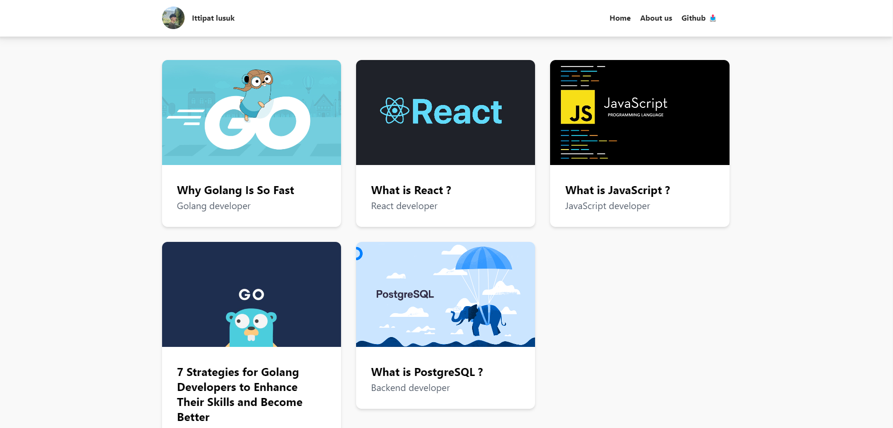

# Myblogs — Microservices Blog Platform

A blog platform built with **Go microservices** (Fiber, Clean Architecture) communicating through **Kafka**, with a **React** frontend. Uses **PostgreSQL**, **Redis** caching, and is deployable with **Docker Compose** or **Kubernetes**.



## Architecture

```
React (Vite) ──HTTP──► userservice ──Kafka event──► blogservice
                          │           (user.created)     │
                          ▼                              ▼
                      PostgreSQL  ◄── Redis (cache) ──►  PostgreSQL
```

- **userservice** — จัดการผู้ใช้ และ produce event เข้า Kafka
- **blogservice** — จัดการบล็อก และ consume event จาก userservice

## Tech Stack

| Layer | Tech |
|---|---|
| Frontend | React (Vite), TailwindCSS |
| Backend | Go (Fiber, Clean Architecture, GORM) |
| Database | PostgreSQL |
| Cache | Redis |
| Message Queue | Kafka |
| Infra | Docker Compose, Kubernetes |

## Run locally

ต้องมี Docker Desktop, Go, Node.js

```bash
# 1. ยก infra (postgres, redis, kafka, zookeeper)
docker-compose up -d

# 2. รัน backend (คนละ terminal, รันจากในโฟลเดอร์ app/)
cd userservice/app && go run main.go     # :8001
cd blogservice/app && go run main.go     # :8002

# 3. รัน frontend
cd my-blog-react && npm install && npm run dev   # :8003
```

## ผลลัพธ์การเชื่อมต่อ Tools และ Infras 

- [Redis — caching / cache hit ](docs/demo/redis.md)
- [Kafka — produce / consume event ข้าม service](docs/demo/kafka.md)
- [PostgreSQL — schema migration & query (จาก terminal docker)](docs/demo/database.md)
- [Kubernetes — deploy บน cluster / self-healing](docs/demo/kubernetes.md)

## API (summary)

| Method | Endpoint | Service | หน้าที่ |
|---|---|---|---|
| POST | `/v1/myblogs/register` | userservice :8001 | สมัคร user |
| GET | `/v1/myblogs/getUsers` | userservice :8001 | ดู user ทั้งหมด |
| POST | `/v1/myblogs/createBlog/:userId` | blogservice :8002 | สร้างบล็อก |
| GET | `/v1/myblogs/getBlogs` | blogservice :8002 | ดึงบล็อกทั้งหมด |
